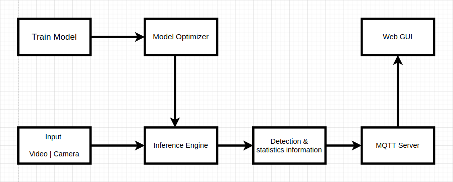

# People-counter-app
This project is from the Udacity nano degree Intel edge AI IoT program. The main idea to this project is use a model from any framework, and optimze it bu using openVino toolkit. Make the infrence on the video from the resources directory by using optimized model. And count the number of people in the frame and total number of people in the video. Calculte the average time of person stayed in video. And send all these calculated values along-with the image to the webpage using Mosca server.

## What is it:
OpenVino toolkit is used to optimize the model. During optimization opevino decrease the model size and oprations. Due drcrease in the size model load time is also decrease and inference time is also decrease. Hence we deploy the optimized model on low cost embedded devices.
## About the code:
We use tensorFlow object detection model in this code. We use the the ssdmobilenet_v2 and run the inference in the 
[Note-book](https://github.com/tensorflow/models/blob/master/research/object_detection/colab_tutorials/inference_from_saved_model_tf2_colab.ipynb) 
and the optimized the model usin openvino. The infrence on the optimized model is in the 
[main.py](https://github.com/Abdulrehmanghani/People-counter-app/blob/main/main.py) file.

### Model zoo
We have use [SSD MobileNet v2 ](http://download.tensorflow.org/models/object_detection/ssd_mobilenet_v2_coco_2018_03_29.tar.gz) tensorflow object detection [model zoo](https://github.com/tensorflow/models/blob/master/research/object_detection/g3doc/tf2_detection_zoo.md)

<table>
  <thead>
    <tr style="text-align: right;">
      <th></th>
      <th>Model name</th>
      <th>Speed (ms)</th>
      <th>COCO mAP</th>
      <th>Outputs</th>
    </tr>
  </thead>
  <tbody>
    <tr>
      <th>0</th>
      <td>SSD MobileNet v2 320x320</td>
      <td>19</td>
      <td>20.2</td>
      <td>Boxes</td> 
    </tr>
  </tbody>      
</table>

  To run the inference on the model use this [Note-book.](https://github.com/Abdulrehmanghani/People-counter-app/blob/main/inference_from_saved_model_tf2_colab.ipynb)</br>
  To download the model from the terminalrun this command:
  ```
  wget http://download.tensorflow.org/models/object_detection/ssd_mobilenet_v2_coco_2018_03_29.tar.gz
tar -xf ssd_mobilenet_v2_coco_2018_03_29.tar.gz
```
To optimize the model use this command in the terminal</br>  
  ```
python3 /opt/intel/openvino/deployment_tools/model_optimizer/mo_tf.py –input_model ssd_mobilenet_v2_coco_2018_03_29/frozen_inference_graph.pb --tensorflow_use_custom_operations_config /opt/intel/openvino/deployment_tools/model_optimizer/extensions/front/tf/ssd_v2_support.json -- tensorflow_object_detection_api_pipeline_config ssd_mobilenet_v2_coco_2018_03_29/pipeline.config -- reverse_input_channels -o optimized_model
  ```

## Requirements

### Hardware

* 6th to 10th generation Intel® Core™ processor with Iris® Pro graphics or Intel® HD Graphics.
* OR use of Intel® Neural Compute Stick 2 (NCS2)
* OR Udacity classroom workspace for the related course

### Software

*   Intel® Distribution of OpenVINO™ toolkit 2019 R3 release
*   Node v6.17.1
*   Npm v3.10.10
*   CMake
*   MQTT Mosca server
  
        
## Setup

### Install Intel® Distribution of OpenVINO™ toolkit

The relevant instructions for Linux/Ubuntu operating system for this step.

- [Linux/Ubuntu](./linux-setup.md)

### Install Nodejs and its dependencies

The relevant instructions for the Linux/Ubuntu operating system for this step.

- [Linux/Ubuntu](./linux-setup.md)

### Install npm

There are three components that need to be running in separate terminals for this application to work:

-   MQTT Mosca server 
-   Node.js* Web server
-   FFmpeg server
     
From the main directory:

* For MQTT/Mosca server:
   ```
   cd webservice/server
   npm install
   ```

* For Web server:
  ```
  cd ../ui
  npm install
  ```
  **Note:** If any configuration errors occur in mosca server or Web server while using **npm install**, use the below commands:
   ```
   sudo npm install npm -g 
   rm -rf node_modules
   npm cache clean
   npm config set registry "http://registry.npmjs.org"
   npm install
   ```
   ## Run the application

From the main directory:

### Step 1 - Start the Mosca server

```
cd webservice/server/node-server
node ./server.js
```

You should see the following message, if successful:
```
Mosca server started.
```

### Step 2 - Start the GUI

Open new terminal and run below commands.
```
cd webservice/ui
npm run dev
```

You should see the following message in the terminal.
```
webpack: Compiled successfully
```

### Step 3 - FFmpeg Server

Open new terminal and run the below commands.
```
sudo ffserver -f ./ffmpeg/server.conf
```

### Step 4 - Run the code

Open a new terminal to run the code. 

#### Setup the environment

You must configure the environment to use the Intel® Distribution of OpenVINO™ toolkit one time per session by running the following command:
```
source /opt/intel/openvino/bin/setupvars.sh -pyver 3.5
```

You should also be able to run the application with Python 3.6, although newer versions of Python will not work with the app.

#### Running on the CPU

When running Intel® Distribution of OpenVINO™ toolkit Python applications on the CPU, the CPU extension library is required. This can be found at: 

```
/opt/intel/openvino/deployment_tools/inference_engine/lib/intel64/
```

Though by default application runs on CPU, this can also be explicitly specified by ```-d CPU``` command-line argument:

```
python main.py -i resources/Pedestrian_Detect_2_1_1.mp4 -m optimized_model/frozen_inference_graph.xml -d CPU -pt 0.6 | ffmpeg -v warning -f rawvideo -pixel_format bgr24 -video_size 768x432 -framerate 24 -i - http://0.0.0.0:3004/fac.ffm
```
To see the output on a web based interface, open the link [http://0.0.0.0:3004](http://0.0.0.0:3004/) in a browser.

